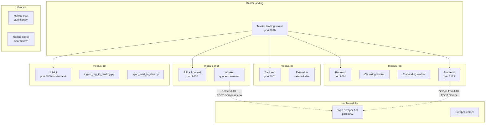
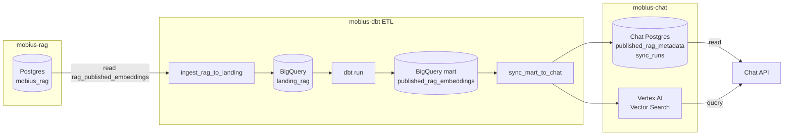
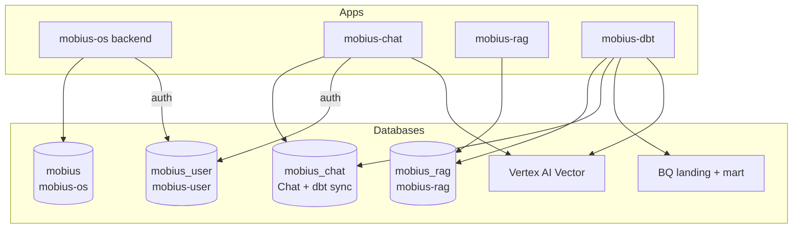

# Mobius Architecture Schematic

High-level view of modules, services, workers, and data flow. See [DB_INVENTORY.md](DB_INVENTORY.md) and [DB_PROPOSAL.md](DB_PROPOSAL.md) for DB details.

---

## 1. Modules and services

- **Master landing** (3999): Single page with links to each module and “Stop all Mobius.” Started by `mstart` unless `--no-landing`.
- **mobius-os:** Backend (5001), extension (webpack). Own Postgres (`mobius`). No RAG/Chat DB.
- **mobius-chat:** API + frontend (8000), worker (queue). Reads Chat Postgres + Vertex.
- **mobius-rag:** Backend (8001), chunking worker, embedding worker, frontend (5173). Own Postgres (`mobius_rag`).
- **mobius-skills:** Web scraper API (8002), scraper worker. Invoked by Chat (URL in message) and RAG frontend (Scrape from URL). Writes to GCS; RAG can import from GCS.
- **mobius-dbt:** Job UI (6500, run on demand), ingest script, sync script. No own DB; reads RAG Postgres, writes Chat Postgres + BigQuery + Vertex.
- **mobius-user:** Library only; own DB (`mobius_user`). Consumed by mobius-os and mobius-chat for auth.
- **mobius-config:** Shared `.env` and scripts; no server.

---

## 2. Data flow (RAG → Chat)

- **mobius-rag** Postgres holds `rag_published_embeddings` (and other RAG tables).
- **mobius-dbt** reads RAG Postgres → BigQuery landing → dbt mart; then `sync_mart_to_chat.py` writes **Chat Postgres** (`published_rag_metadata`, `sync_runs`) and **Vertex AI** vector index.
- **mobius-chat** reads the same Chat Postgres and queries Vertex for retrieval.

---

## 3. Databases and auth

- **mobius** (PG): mobius-os only. No shared tables with RAG/Chat.
- **mobius_rag** (PG): mobius-rag; dbt reads from here.
- **mobius_chat** (PG): Chat app + dbt sync write; `CHAT_RAG_DATABASE_URL` and `CHAT_DATABASE_URL` must match.
- **mobius_user** (PG): mobius-user; mobius-os and mobius-chat use for auth. Cross-ref by `user_id` only; no cross-DB FKs.

---

## 4. User preferences vs app settings

**Preferences** (in the auth/account UI) means **user preferences**: profile (name, timezone), activities, AI comfort (tone, autonomy), greeting. These are shared between the extension and chat via the shared `@mobius/auth` package (`createPreferencesModal`). The AuthModal’s “Preferences” link opens this user-preferences modal. **App/surface settings** are separate: in chat, the hamburger menu opens the **drawer** (LLM config, prompts); in the extension, mini/settings are extension-specific. Same users and tokens; one user-preferences experience.

---

## 5. Credentials and config (summary)

| Concern | Env / config | Modules |
|--------|---------------|---------|
| GCP | `GOOGLE_APPLICATION_CREDENTIALS`, `VERTEX_PROJECT_ID`, `VERTEX_LOCATION`, `GCS_BUCKET` | Chat, RAG, dbt |
| Chat DB | `CHAT_RAG_DATABASE_URL` | mobius-chat |
| Chat DB (sync) | `CHAT_DATABASE_URL` | mobius-dbt (must match Chat) |
| RAG DB | `DATABASE_URL` | mobius-rag |
| RAG DB (dbt read) | `POSTGRES_HOST`, `POSTGRES_DB` (mobius_rag), etc. | mobius-dbt |
| OS DB | `POSTGRES_*_LOCAL` / `POSTGRES_*_CLOUD`, `DATABASE_MODE` | mobius-os |
| User DB | `USER_DATABASE_URL` | mobius-user; consumed by OS and Chat |
| JWT | `JWT_SECRET` | mobius-user; must match across OS and Chat |
| BigQuery | `BQ_PROJECT`, `BQ_DATASET` | mobius-dbt |
| Vertex index | `VERTEX_INDEX_ID`, `VERTEX_INDEX_ENDPOINT_ID`, etc. | mobius-dbt, mobius-chat |
| Scraper | `SCRAPER_API_BASE` (e.g. `http://localhost:8002`), `REDIS_URL`, `GCS_BUCKET` | mobius-chat (calls scraper), mobius-skills (scraper) |

See [DATA_SCHEMA_AND_CREDENTIALS.md](DATA_SCHEMA_AND_CREDENTIALS.md) for full env and schema reference. See section 4 above for user preferences vs app settings.

---

## 6. Future: monitoring dashboard

The **Master landing** (port 3999) currently shows a **red/green/yellow/grey status** per service (via `GET /api/status`, which probes each service’s health or root URL). It is intended to evolve into a **monitoring dashboard** when services expose richer data: e.g. active workers, users, threads, queue depth. To support that, each service would expose a small **metrics or status** endpoint (e.g. `GET /metrics` or `GET /status`) returning counts or a small JSON; the landing server would call those URLs and merge the result into `GET /api/status`, and the landing page would display workers/users/threads when present.
