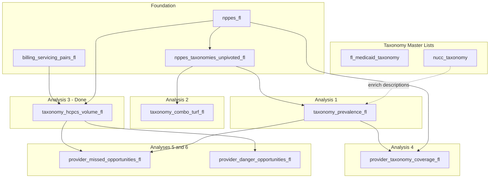

# FL Medicaid NPI Initiative — Analysis Series

FL-only scope. Sequence of analyses with clear input/output, success metrics, and predictive power.

---

## Foundation: Taxonomy Master Lists

| View | Source | Purpose |
|------|--------|---------|
| `fl_medicaid_taxonomy` | `landing_medicaid_npi.stg_tml` (GCS raw/tml/) | FL Medicaid-approved taxonomies for claims |
| `nucc_taxonomy` | `landing_medicaid_npi.stg_nucc_taxonomy` (GCS raw/nucc_taxonomy/) | **National NUCC** taxonomy code set — descriptions for any code |

**National NUCC taxonomy (new):**

- **Source:** NUCC CSV (e.g. https://www.nucc.org/images/stories/CSV/nucc_taxonomy_250.csv). No BigQuery public dataset.
- **Load:** GCS `raw/nucc_taxonomy/nucc_taxonomy_250.csv` → BigQuery `landing_medicaid_npi.stg_nucc_taxonomy` → mart `nucc_taxonomy`.
- **Output:** taxonomy_code, taxonomy_description, provider_grouping, classification, area_of_specialization (or equivalent NUCC columns).
- **Use:** Resolve any NPPES taxonomy code to human-readable description; validate "is this a valid taxonomy?"; enrich prevalence/coverage analyses.
- **Refresh:** NUCC publishes twice yearly (Jan, July).

---

## Foundation: FL-Only Views

| View | Input | Output | Purpose |
|------|-------|--------|---------|
| `nppes_fl` | npi_optimized | NPIs with FL practice address | No state bleed |
| `nppes_taxonomies_unpivoted_fl` | nppes_fl | (npi, taxonomy_code, taxonomy_slot, is_primary) | Single source for per-NPI taxonomies; feeds prevalence and analyses |
| `billing_servicing_pairs_fl` | billing_servicing_pairs, nppes_fl | Pairs where billing and servicing NPIs in FL | Restrict volume to FL |

---

## Analysis 1: Taxonomy Prevalence

**Input:** `nppes_taxonomies_unpivoted_fl`

**Logic:** Unpivot taxonomy 1–15; for each taxonomy T, count % of FL cohort with T in any slot.

**Output:** `taxonomy_prevalence_fl`

| Column | Description |
|--------|-------------|
| taxonomy_code | Taxonomy code |
| npi_count | NPIs in FL with this taxonomy |
| cohort_size | Total FL NPIs |
| pct | Prevalence % |
| rank | Rank by prevalence |
| taxonomy_description_fl_medicaid | FL TML description (if in TML) |
| taxonomy_description_national | National NUCC description (if in nucc_taxonomy) |
| top_credentials | Credential mix from NPPES (e.g. "MD (45%), DO (20%), NP (15%)") |

**Success metric:** Top taxonomies by prevalence are plausible (e.g. common specialties, entity types). No impossible codes.

**Predictive power:** Baseline for "what's typical in FL." Feeds: provider taxonomy coverage score; missed-opportunity detection (provider lacks common taxonomy).

---

## Analysis 2: Taxonomy Combos (TURF-style T1→T2→…→T5)

**Input:** `nppes_taxonomies_unpivoted_fl`

**Logic:** Sequential TURF. Start with primary taxonomy (T1). Among NPIs with T1, rank T2 by prevalence. Among those with T1+T2, rank T3. Continue to T5. Depth 5 to inspect tail.

**Output:** `taxonomy_combo_turf_fl`

| Column | Description |
|--------|-------------|
| primary_taxonomy | T1 (slot 1) |
| t2, t3, t4, t5 | Subsequent taxonomies in sequence (nullable) |
| sequence_length | 1–5 |
| npi_count | NPIs with full sequence |
| pct_of_cohort | % of FL cohort |
| pct_of_t1 | % of primary-taxonomy cohort (more actionable) |
| cohort_size | Total FL NPIs |
| top_credentials | Credential mix from NPPES for primary taxonomy |

**Success metric:** Common sequences make clinical sense (e.g. Psychiatrist → subspecialty). Tail inspection informs depth cutoff.

**Predictive power:** "Provider has T1,T2 but lacks T3; 35% of FL peers with T1+T2 also have T3" → missed combo.

---

## Analysis 3: Taxonomy → HCPCS Volume (TURF-level)

**Input:** `billing_servicing_pairs_fl`, `nppes_taxonomies_unpivoted_fl`

**Logic:** At TURF combo level (depth 2: T1 and T1+T2). Join servicing NPI to taxonomy combos. For each (primary_taxonomy, t2, hcpcs_code): sum claim_count, total_paid.

**Output:** `taxonomy_hcpcs_volume_fl`

| Column | Description |
|--------|-------------|
| primary_taxonomy | T1 (primary) |
| t2 | Second taxonomy (nullable for sequence_length=1) |
| sequence_length | 1 or 2 |
| hcpcs_code | HCPCS |
| claim_count | Total claims |
| total_paid | Total spend |
| npi_count | Distinct NPIs billing this combo |

**Success metric:** Top (taxonomy combo, HCPCS) align with known clinical practice.

**Predictive power:** "Peers with T1+T2 bill codes X, Y, Z" → capability map. Feeds missed (add T to unlock) and danger (codes unusual for combo).

**Extension: `taxonomy_hcpcs_volume_indexed_fl`** — Utilization indexing (probabilistic success proxy). claims_per_beneficiary, spend_per_beneficiary; claims_index, spend_index; hcpcs_stddev_*; claims_z_score, spend_z_score (std deviations from cohort mean); is_outlier (|z| > 2).

---

## Analysis 4: Provider Taxonomy Coverage Score

**Input:** `nppes_fl`, `taxonomy_prevalence_fl`

**Logic:** For each provider, compare their taxonomy set to cohort prevalence. Score = weighted sum of prevalence of taxonomies they have (or inverse: penalty for missing high-prevalence taxonomies).

**Output:** `provider_taxonomy_coverage_fl`

| Column | Description |
|--------|-------------|
| npi | Provider NPI |
| taxonomy_count | Number of taxonomies |
| coverage_score | 0–100 |
| missing_high_prevalence | Top taxonomies they lack |

**Success metric:** Scores correlate with "typical" vs "outlier" providers.

**Predictive power:** Low coverage → likely data gaps or niche provider; high coverage → well-aligned with cohort.

---

## Analysis 5: Missed Opportunities (Draft)

**Input:** `provider_taxonomy_coverage_fl`, `taxonomy_prevalence_fl`, `taxonomy_hcpcs_volume_fl`

**Logic:** Provider lacks taxonomy T; T is common in cohort; T unlocks codes with high volume. Flag: "Add T to unlock X, Y."

**Output:** `provider_missed_opportunities_fl`

**Success metric:** Actionable recommendations; low false positives.

**Predictive power:** Direct revenue-growth signal.

---

## Analysis 6: Danger Opportunities (Draft)

**Input:** `billing_servicing_pairs_fl`, `taxonomy_hcpcs_volume_fl`, `nppes_fl`

**Logic:** Provider bills code Z; for their taxonomy set, cohort rarely bills Z (low volume). Flag: "Review billing of Z."

**Output:** `provider_danger_opportunities_fl`

**Success metric:** High-risk billings surfaced; denials/recoup risk.

**Predictive power:** Direct denial-prevention signal.

---

## Sequence and Dependencies

---

## Implementation Order

| Step | View / Asset | Status |
|------|--------------|--------|
| 0a | Load NUCC CSV to GCS `raw/nucc_taxonomy/` | — |
| 0b | Create `stg_nucc_taxonomy` in landing_medicaid_npi | — |
| 0c | Create mart `nucc_taxonomy` (national taxonomy master) | — |
| 1 | nppes_fl | Done |
| 2 | nppes_taxonomies_unpivoted_fl | Done |
| 3 | billing_servicing_pairs_fl | Done |
| 4 | taxonomy_prevalence_fl (Analysis 1) | Done |
| 5 | Review Analysis 1 | — |
| 6 | taxonomy_combo_turf_fl (Analysis 2) | Done |
| 7 | taxonomy_hcpcs_volume_fl (Analysis 3) | Done |
| 8 | provider_taxonomy_coverage_fl (Analysis 4) | Done |
| 9 | provider_missed_opportunities_fl (Analysis 5) | Done |
| 10 | provider_danger_opportunities_fl (Analysis 6) | Done |
| — | **Address validation (data accuracy)** | |
| — | npi_addresses_fl (incl. PML service location for B1) | Done |
| — | address_validation_fl (B1, B2, B3) | Done |
| — | taxonomy_validation_fl (C1, C2, C3, C4) | Done |
