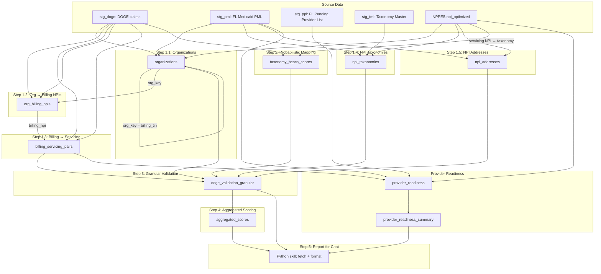

# FL Medicaid NPI Validation Pipeline — Strategy Schematic

## B0–B6 validation layers (canonical)

Single read head for front end and chat: **B6**. Query by **org_id**, **npi**, or **site_id**; B6 returns all details from B0–B5. See `mobius-dbt/docs/B6_INTEGRATED_REPORT.md`.

| Layer | Purpose | Consumers |
|-------|---------|-----------|
| **B0** | Roster / org structure (facility list, sub-org by address, billing-NPI groups, roster list) | B6 only |
| **B1** | NPPES vs PML alignment (service location / address, e.g. ZIP+9) | B6 only |
| **B2** | Address info (mailing vs practice; informational) | B6 only |
| **B3** | Taxonomy alignment (NPPES vs FL allowed) | B6 only |
| **B4** | Medicaid ID check (roster per NPI, permissible) | B6 only |
| **B5** | Medicaid ID + NPI + taxonomy + site alignment (combined rule) | B6 only |
| **B6** | **Integrated report** — all B0–B5 detail; query by org_id, npi, or site_id | Front end, Chat |

---

## Data flow and table relationships



## Table dependency chain

| Step | Table | Depends on | Feeds into |
|------|-------|------------|------------|
| **1.1** | `organizations` | DOGE (billing_tin), NPPES, PML | 1.2, 3 |
| **1.2** | `org_billing_npis` | DOGE, organizations | 3 |
| **1.3** | `billing_servicing_pairs` | DOGE | 3 |
| **1.4** | `npi_taxonomies` | NPPES, TML, PML | 2, 3 |
| **1.5** | `npi_addresses` | NPPES, PML | 3 |
| **2** | `taxonomy_hcpcs_scores` | DOGE, NPPES | 3 |
| **3** | `doge_validation_granular` | All of 1.1–1.5, 2 | 4, 5 |
| **4** | `aggregated_scores` | doge_validation_granular | 5 |
| **5** | Python skill | aggregated_scores, doge_validation_granular | Chat UI |
| — | `provider_readiness` | billing_servicing_pairs, NPPES, PML, PPL | provider_readiness_summary |
| — | `provider_readiness_summary` | provider_readiness | Chat UI |

## Key relationships

```
organizations (org_key = billing_tin)
    ↓
org_billing_npis (org_key → billing_npi list)
    ↓
billing_servicing_pairs (billing_npi → servicing_npi, hcpcs, spend)
    ↓
doge_validation_granular (per-claim row + taxonomy_score, address_match, fl_enrolled)
    ↓
aggregated_scores (org / billing_npi / servicing_npi level, weighted by spend)
    ↓
Python → Chat
```

## Problems today vs next quarter

### Problems today (current scope)

**Provider identity and enrollment** — 1/0 score per NPI per claim period:

- Valid NPI (exists in NPPES)
- Enrolled in FL Medicaid (in PML)
- Effective dates overlap claim period (when PML has contract_effective_date / contract_end_date)

Output: `provider_readiness` and `provider_readiness_summary` with `report_date` (point-in-time). Run monthly; for March 1st: `dbt run --vars 'report_date: 2026-03-01' --select provider_readiness provider_readiness_summary`.

### Problems next quarter

- Taxonomy reconciliation (NPPES vs TML vs PML) — surface discrepancies
- Taxonomy–HCPCS alignment (service validity)
- Address match (enrolled vs NPPES)
- NCCI / service-level edits
