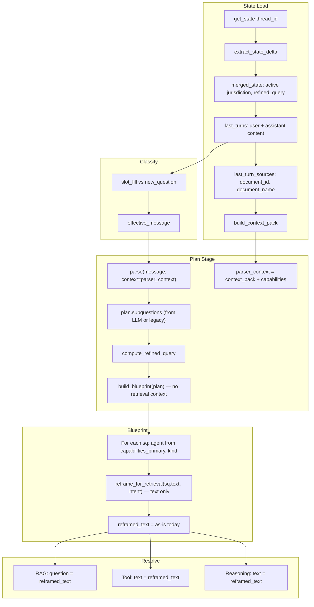
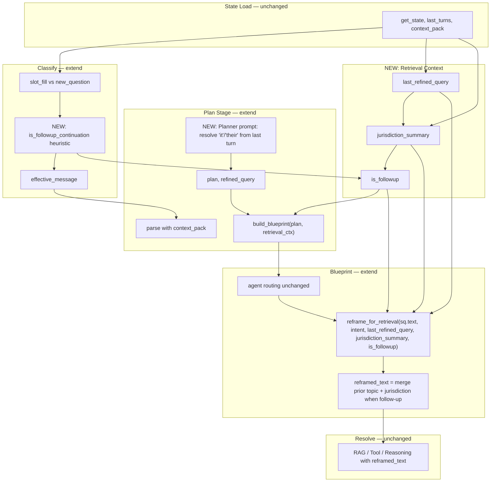

# Follow-up Continuity: Current State vs Proposed Changes

Schematic of the chat pipeline for multi-turn conversations and where follow-up continuity improvements apply.

---

## Current State



### Data Flow Today

| Component | What it receives | What it uses |
|-----------|------------------|--------------|
| **Parser** | `message` + `context_pack` (jurisdiction, last turn user/assistant) | LLM sees prior turn; may or may not expand "it", "their" |
| **reframe_for_retrieval** | `sq.text`, `intent` only | Returns text as-is (no merge with prior topic/jurisdiction) |
| **build_blueprint** | `plan` only | No `last_refined_query`, no `jurisdiction_summary`, no `is_followup` |
| **compute_refined_query** | `classification`, `last_refined_query`, `plan_subquestion_text` | slot_fill → merge jurisdiction; new_question → use plan text |
| **Resolve** | `reframed_text` from blueprint | RAG retrieves with that query; Tool uses that text |

### Gaps

1. **"can you search the web for it"** — Parser gets last turn in context but may output `sq.text = "can you search the web for it"`; `reframe_for_retrieval` passes it through. No merge of prior topic (income criteria, Florida Medicaid).
2. **"can you read their website"** — Same: "their" and "specific income criteria" rely on prior turn; no explicit merge into retrieval query.
3. **classification** — "can you search for it" may be `new_question` (not slot_fill), so `refined_query` becomes plan text, losing prior topic.
4. **reframe_for_retrieval** — Never receives `last_refined_query` or jurisdiction; cannot merge.

---

## Proposed Changes



### Proposed Data Flow

| Component | Change |
|-----------|--------|
| **Planner prompt** | Add: "For follow-ups that reference prior topic ('it', 'their', 'that'), expand into concrete terms from the last turn. E.g. 'can you search for it' → 'Search for [prior topic from last turn]'." |
| **Classify** | Add `is_followup_continuation`: same thread, message looks like continuation (short, references "it"/"their"/"that"), last turn had substantive answer. |
| **build_blueprint** | Accept `retrieval_ctx`: `{last_refined_query, jurisdiction_summary, is_followup}`. Pass to `reframe_for_retrieval`. |
| **reframe_for_retrieval** | New params: `last_refined_query`, `jurisdiction_summary`, `is_followup`. When follow-up: merge topic from `last_refined_query` into `sq.text`, append jurisdiction if missing. |
| **run_plan** | After `compute_refined_query`, build `retrieval_ctx` from `ctx.refined_query`, jurisdiction from `ctx.merged_state`, `is_followup` from classify. Pass to `build_blueprint`. |

### Example: "can you search the web for it"

**Current:**
```
last_turn: User: "can you read their website and tell me the specific income criteria"
           Assistant: "The system cannot provide..."
sq.text = "can you search the web for it"
reframed_text = "can you search the web for it"  (no change)
RAG/Tool receives: "can you search the web for it"  → vague, no topic
```

**Proposed:**
```
last_refined_query = "specific income criteria for Florida Medicaid from Sunshine Health website"
jurisdiction_summary = "Sunshine Health, Florida"
is_followup = true
sq.text = "can you search the web for it"  (or planner expands to "Search for Florida Medicaid income eligibility")
reframe_for_retrieval merges: "Search for Florida Medicaid income eligibility criteria"
reframed_text = "Search for Florida Medicaid income eligibility criteria"
Tool receives concrete search query
```

---

## Files to Change

| File | Change |
|------|--------|
| `config/prompts_llm.yaml` | Add follow-up expansion instruction to `decompose_system_mobius` |
| `app/state/refined_query.py` | Add `is_followup_continuation()` or extend `classify_message` |
| `app/stages/plan.py` | Build `retrieval_ctx`, pass to `build_blueprint` |
| `app/planner/blueprint.py` | Accept `retrieval_ctx`, pass to `reframe_for_retrieval` |
| `app/state/query_refinement.py` | Extend `reframe_for_retrieval` with `last_refined_query`, `jurisdiction_summary`, `is_followup` |

---

## Master Objective List & User as Leverage

**Problem:** The system tends to satisfy itself with answering the question in the *last turn*, not with achieving the user’s original objective. It lacks a persistent master list of objectives.

**Desired behavior:**
- Maintain a **master action list / objective list** per thread.
- Be **relentless** until the user’s objective is achieved.
- Use the **user as leverage** when stuck: e.g. “I couldn’t find the code—do you know where I can find it?” or “Do you have a link or document that might help?”
- **Success metric:** Did the system solve the user’s question?

The real test for the system is: **did it solve the user’s question?** Not “did it answer the last turn?”

---

**→ Full design:** [RELENTLESS_CONTINUITY_PLAN.md](./RELENTLESS_CONTINUITY_PLAN.md) — data model, user-ask triggers, implementation phases.

---

## Out of Scope (This Schematic)

- **Day 2 routing** — "Search for X" → tool (blueprint pattern override)
- **Empty/malformed input** — "empty message", "payor.community_care_plan" handling
- **Option B (previous documents)** — Include prior turn sources in retrieval (FOLLOWUP_CONTINUITY_PLAN Phase 2)
