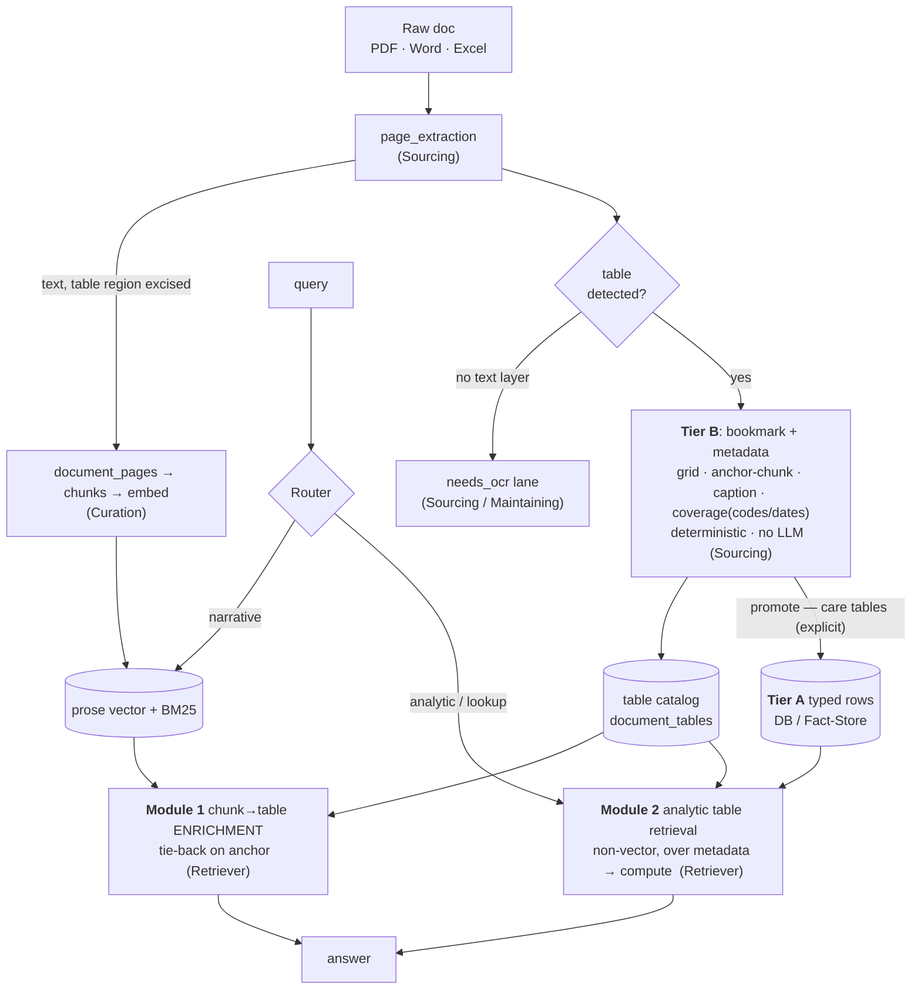

# Table Extraction & Tiered Materialization — Spec (for architect sign-off)

**Status:** DRAFT **v0.2**, **Sourcing** 2026-08-19. *(v0.2: Retriever promoted to primary client — the retrieve-side is two Retriever-owned modules, not an FYI. §5 rewritten.)*
Circulated for sign-off: **Technical Review** (structural) · **DB architect** (schema authority) ·
**Master RAG** (structure/seams/sequencing) · **Retriever** (primary client — retrieve-side) · **UX** (table render) · **Eval** (metrics) · **Product-Awareness** (FYI/schematic).
Companion: [`module-map.md`](module-map.md) · [`raw-doc-contract.md`](raw-doc-contract.md) (gated) · POC: `scratchpad/table-extract-poc/`.

**Design is gated on sign-off; detection recall is gated on the reingest test (§9), not proven here.**

---

## 1. Problem
Corpus mixes prose and tables (PDF fee schedules, Word, Excel). Tables fail RAG two ways:
- **(a) Retrieval** — a table linearized into text embeds into a mushy vector; "what's the rate for H0031" has nothing coherent to match. And **dense vectors are numeric-blind**: measured on a real doc, "per diem over $250" scored ~flat (0.74–0.77) whether the cell was $95, $266, or $1,050 — so threshold/aggregate questions are *unanswerable* by embeddings at all (→ Module 2 typed-store compute, not vector).
- **(b) Fidelity** — PDF→text collapses columns and strands headers, so what we *return* is garbled (POC, §10).

Two classes of table, which map onto the two retrieve-side modules (§5):
- **"passenger" tables** — incidental; must survive, render, and ride along with the prose that references them. → **enrichment (Module 1)**.
- **"care" tables** — structured, analytically valuable (fee schedules, rate grids, crosswalks). → **analytic retrieval + compute (Module 2)**.

**Blast radius — measured, live corpus 2026-08-19** (`scratchpad/table-extract-poc/store_probe*.py`, read-only): 1.94M published chunks / 204k pages. **Numeric CPT codes are already BM25-blind ~20%** (554 code-occurrences in `.text`, only 442 findable via `search_vec`), spiking to **50–60% for specific codes** (90837: 50→23; 96130: 18→7; 90846: 20→9). **Alphanumeric HCPCS is fine** (H0031 findable ≥ text) — a letter prefix gives the tokenizer a word boundary; pure-numeric codes glue into adjacent numbers and fall out of the lexical index. **This is a *current* defect, not a future-excision risk.** 10.5k rows have a 5-digit code glued to a letter. Fee-table footprint: **~15k pages (7%) fee-ish, 3.2k (2%) dense fee tables**, 2.3k with pipe-tables — the high-value "care" slice. → the discrete `coverage` array + registry validation (§4) extracts the code as a first-class value and matches it *exactly*, sidestepping the tsvector parser that drops it today. *(Caveat: `text ~ code` is substring-matched — exact %s carry noise; the numeric-vs-alphanumeric gap is robust.)*

## 2. Design — tiered materialization + one table catalog
Capture cheap for **every** table; pay the structuring cost only for the ones that earn it. Tables get their **own home and their own retrieval logic** — we stop trying to make them behave like prose in the vector index.

- **Tier B (every table, at ingest — Sourcing):** detect the table, emit a **deterministic bookmark + metadata** into a **table catalog** (`document_tables`): the cell grid, a pointer `(doc_id, page, bbox)`, and the metadata that powers retrieval (§4). No LLM.
- **Tier A (promoted, "care" tables):** map the grid to **typed, queryable rows** (columns → fields) the analytic module computes over.

**Three locks:**
1. **B stores the grid + an association anchor, not just a pointer.** Page-level tie-back over-attaches; capture the *anchor chunk/caption* that introduces the table (this is what makes Module 1 correct).
2. **Promotion to A is explicit (v1), against reusable per-type contracts.** One "fee-schedule" contract covers ~140 AHCA files; usage-auto-promote is v2 (needs table-hit telemetry).
3. **Retrieval over tables is not vector.** Enrichment is a join on the anchor; analytic retrieval is structured+lexical over metadata. The prose vector index stays prose.

## 3. Schematic



## 4. Tier B — the catalog row (POC-verified grid + metadata)
Emitted by `page_extraction` for every detected table. Deterministic; no schema decisions.
```json
{ "kind": "table", "doc_id": "…", "page": 1, "table_index": 0,
  "bbox": [76.0, 156.0, 536.0, 264.0],
  "anchor": {"chunk_id": "…", "section_path": "…", "caption": "…the following maximum reimbursement rates apply…"},
  "header": ["HCPCS Code","Description","Modifier","Rate","Effective Date"],
  "rows": [["H0031","Mental health assessment…","HO","$118.42","2024-01-01"], … ],
  "coverage": {"codes": ["H0031","H0004","H2011","H0038","T1017"], "date_range": ["2024-01-01","2024-07-01"]},
  "n_rows": 5, "n_cols": 5, "detector": "lines", "confidence": 0.97 }
```
- **`anchor`** — the tie-back key for Module 1 (introducing chunk/section/caption). Deterministic: nearest preceding heading/intro + the excised region's chunk.
- **`coverage`** — deterministic distinct-values over key columns (codes, dates, payer/state if present). This is what Module 2 searches — no LLM.
- **Storage (DB call, §11):** `document_tables` table vs JSONB on `document_pages`.
- **Cleaner prose too:** the table region is **excised** from the text handed to chunking, so passenger tables stop polluting prose chunks (Curation win).
- **Control flow — extraction-stage, NOT chunk-stage (this is the mental-model trap).** The loop is *detect table → extract grid → replace region → continue*, but it MUST run in `page_extraction` where the **PDF geometry** (cell positions / ruling lines) still exists — `pdfplumber.find_tables()` reads the page object, not a string. By chunk-time only the linearized mangle remains (`\xa0Model\xa010A`, headers stacked, values elsewhere); the grid is unreconstructable from that. So the chunker never gets table logic — it receives clean text and splits normally. The region's **replacement** is a compact breadcrumb (`[Table: caption · codes … · →document_tables:uuid]`) left inline: one meaningful chunk instead of 4,000 `-` fragments, and it keeps codes lexically searchable.
- **⚠️ Lexical-safety — excise ⟺ captured.** Excision removes the table's tokens (esp. **HCPCS codes**) from the *prose* BM25 index — a code that lives only in the table goes BM25-invisible in prose (POC `lexical_reachability.py`: **4/5 codes go dark**). So **only excise a region whose codes are confirmed captured in the catalog** — the table arm then carries the lexical duty (§5). Low-confidence detection → **don't excise** (keep the mangled text), or leave a **code+caption breadcrumb** in prose. Codes also named in surrounding prose (`T1017`) survive there regardless.

## 5. The retrieve-side — Retriever, the primary client (two standalone modules)
Both consume the **one table catalog**; neither touches the prose vector index.

**The table arm is dense + lexical/exact-code — not dense-only.** Excision moves the BM25-on-codes duty from the prose index *into* the table catalog: the arm matches queries against `coverage` (exact code) **and** card FTS, as well as dense card similarity. This is what makes excision safe — a stripped code stays lexically reachable, just via the table arm. (The POC's `+0.15 coverage boost` stands in for this lexical index.)

**Module 1 — chunk→table enrichment (passenger path).** A retrieve-time module: for each retrieved prose chunk, look up tables whose **`anchor`** matches it (chunk/section, page fallback) and include the clean table in the result. Passenger tables ride in this way — no vector-index changes. **Cheapest, highest value; ships on Tier-B bookmarks alone.** Correctness hinges on the `anchor` (§4) — page-only over-attaches. Dedup per distinct table.

**Module 2 — analytic table retrieval (care path).** A standalone queryable interface that **identifies tables by metadata using non-vector logic** — payer/topic/`coverage`(codes,dates)/columns — then **computes over the found tables** (Tier-A typed rows): sums, filters, comparisons. A different retrieval modality for a different question shape ("sum BH rates across these codes / what changed 2023→2024"). Needs the metadata catalog + the typed layer → later than Module 1, and gated on metadata quality (→ detection, §8).

*(Demoted: embedding verbalized row-cards into the prose vector index is now optional — the enrichment + analytic paths keep tables out of prose vector space, which was the original problem. Keep it only if a fallback is wanted.)*

## 6. Tier A — promotion (feeds Module 2's compute)
- **Trigger:** v1 = explicit ("care" mark on a table/type). v2 = usage-driven.
- **Contract:** header→field map, **per table-type**, reusable; fuzzy column match (`Proc Code`≈`HCPCS Code`).
- **Store:** typed rows (DB table per type, or Payor Fact-Store), each stamped `_src (doc_id, page, table_index)`.
- Module 2 computes over these; the Router sends analytic/lookup questions to the module.

## 7. Seams & ownership
| Concern | Owner |
|---|---|
| Detect table + emit Tier-B bookmark **+ metadata (anchor, coverage)** into the catalog | **Sourcing** (this spec) |
| Text stream with table excised → chunk/embed | Curation (benefits; no new work) |
| `document_tables` catalog + Tier-A typed schema/store | **DB / Platform-Architects DB seat** |
| **Module 1 (enrichment) + Module 2 (analytic table retrieval)** | **Retriever** (primary client) |
| Router: narrative→vector vs analytic→Module 2 | Retriever / Router |
| `needs_ocr` docs (no text layer → OCR→cells) | Sourcing / Maintaining (shared OCR lane) |
| Detection recall + retrieval-lift measurement | Eval |

Nothing here reopens the **gated raw-doc seam** — Tier-B capture is *inside* `page_extraction`, upstream of the `chunking_jobs` handoff.

## 8. Detection — the honest risk
POC proves **capture + promotion** are cheap on a ruled table; it proves **nothing about detection**, the hard 80%: borderless/whitespace tables, **`needs_ocr` (276 docs, DB-ratified)** → zero tables, spanning/multi-page (needs `continues_from`), header drift. And **metadata quality (anchor, coverage) rides on detection** — so Module 2 is doubly gated on it. Strategy: tiered detector (ruled → whitespace → OCR), stamp `detector`+`confidence`, flag-don't-drop low confidence, emit detection telemetry.

## 9. Rollout / test — ride the reingest
Reingesting a large batch now = the ideal at-scale detection test:
1. Wire Tier-B capture into `page_extraction` behind `TABLE_CAPTURE=on`, **catalog-only** (no promotion, no Retriever modules yet) — pure additive capture.
2. The reingest backfills the `document_tables` catalog + metadata across the corpus → **the real-corpus detection test** (§8 telemetry).
3. Eval reads recall by doc-type, `needs_ocr` miss-rate, cells-recovered, anchor-hit-rate. **Decide** which types earn Tier-A contracts.
4. Then, in order: **Module 1 (enrichment)** on the bookmarks → first Tier-A contract (fee schedule) → **Module 2 (analytic retrieval)** + Router hook.

Gates: `page_extraction` change token-serialized via **Master RAG**; the catalog/typed store lands after **DB** sign-off; the retrieve-side modules are **Retriever's** build.

## 10. POC evidence — extraction **and retrieval** (`scratchpad/table-extract-poc/`)
Standalone, deterministic, isolated venv. Two POCs:

**Extraction** (`table_extract.py`, no LLM): naive PyPDF2 → cells orphaned, header stranded; pdfplumber grid → exact 5×5 + bbox → verbalized cards → typed rows via a 5-line contract.

**Retrieval** (`retrieval_poc.py`, real dense embedder bge-small, 4 queries) — the "does it retrieve better or is it moot" test. Metric = grounding **precision** (`clean@1` = top-1 is a single fact, not a multi-row jumble):

| condition | answer@1 | clean@1 |
|---|---|---|
| baseline (today: mangled text) | 4/4 | **2/4** |
| A-proper (excised prose + table arm) | 3/4 | 3/4 |
| **A + Module-1 enrichment** | **4/4** | **4/4** |

Findings, evidence-derived (not asserted): (1) direct table lookups go from **mangled multi-row blobs → clean single-row grounding** (Q1 cosine 0.78→0.98); (2) the always-on table arm does **not** degrade the prose control query; (3) **Module 1 anchor enrichment is load-bearing** — the "which service changed in July 2024" query is answerable *only* when the retrieved prose pulls in the row it anchors (prose has the context, the table row has the ISO date; neither alone suffices). Caveat: synthetic single **ruled** table, 4 queries — **corpus-scale detection recall is still the reingest test (§9)**, not this.

## 11. Open questions for sign-off
1. **DB:** `document_tables` catalog — new table vs JSONB on `document_pages`? Tier-A — relational-per-type vs Payor Fact-Store? **`coverage` must be a lexical/exact index (GIN over the code array, or a codes×table join) — it inherits the BM25-on-codes duty excision removes from prose (§4).** (schema authority)
2. **Technical Review:** Tier-B capture a clean addition in `page_extraction` (no god-file, no seam reopen)?
3. **Master RAG:** sequence the flagged `page_extraction` change into the reingest; confirm phase-1 = catalog-only.
4. **Retriever (primary client):** own **Module 1 + Module 2**. The table arm is **dense + lexical/exact-code** (it carries the BM25-on-codes duty excision removes from prose — §5) and enforces **excise ⟺ captured** (§4). Do the two modules share one catalog read-model (proposed: yes — `document_tables`)? Is Module 1 enrichment-on-anchor the right first build off the reingest bookmarks? What do you need in the `anchor`/`coverage` metadata that Sourcing must capture at ingest?
5. **UX:** how a Tier-B table renders in an answer card (enrichment output).
6. **Eval:** own detection-recall + anchor-hit + retrieval-lift metrics off the reingest.

## 12. Sign-off
| Architect / client | Gates | Status |
|---|---|---|
| Technical Review | module boundary / no god-file / no seam reopen | ☐ |
| DB architect | catalog + Tier-A schema/store | ☐ |
| Master RAG | sequencing; phase-1 = catalog-only | ☐ |
| **Retriever (primary client)** | **Module 1 + Module 2 + the metadata it needs** | ☐ |
| UX | table render surface | ☐ |
| Eval | detection + anchor + lift metrics | ☐ |
| Product-Awareness | FYI / schematic | ☐ |

## 13. Deferred / future enhancements (Ananth 2026-08-19 — out of current scope)
1. **Binary-garbage extraction gate → OCR.** ~18 docs extract to <60% ASCII (broken text layer, e.g. the BH Fee Schedule `��i�Q…`; not nbsp-heavy legit text). Conservative gate at `page_extraction` (ascii-fraction low **and** no readable word-runs → route to OCR; exempt multilingual). Folds into the OCR lane.
2. **XLSX / Excel native support** — parse spreadsheets as structured grids (openpyxl) directly, never through the PDF/text path.
3. **"Real path-A" typed tables** — per-type typed contracts, registry-validated `coverage` (HCPCS/CPT via Service Line Registry), structured table understanding (the tier-A / Module-2 analytic path).
4. **OCR lane** — scanned / no-text-layer docs (`needs_ocr`) + the garbage docs in (1); image→cells.
